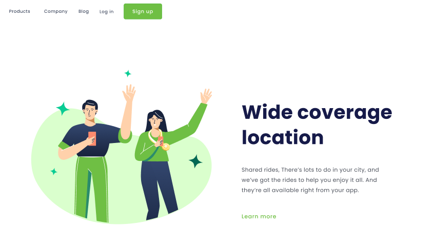
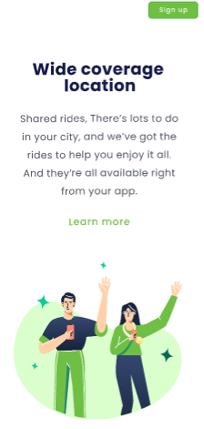

# Desafio-Figma2
<h1>Wide coverage location</h1>

Aqui está um dos meus projetos feitos com o Rodolfo Mori juntamente ao <a href="https://aulas.devclub.com.br/m/courses">DevClub</a>

 

Minhas redes sociais:

